# 🏗️ Arquitectura del Sistema - CTC Daily Hours

**Documentación de Arquitectura y Diagramas**

Versión 2.0 - Febrero 2026

---

## 📑 Tabla de Contenidos

1. [Visión General](#visión-general)
2. [Arquitectura de Alto Nivel](#arquitectura-de-alto-nivel)
3. [Modelo de Datos](#modelo-de-datos)
4. [Arquitectura Frontend](#arquitectura-frontend)
5. [Flujos de Datos](#flujos-de-datos)
6. [Diagramas de Secuencia](#diagramas-de-secuencia)
7. [Patrones de Diseño](#patrones-de-diseño)

---

## Visión General

CTC Daily Hours es una aplicación web SPA (Single Page Application) construida con React que utiliza Supabase como backend. El sistema sigue una arquitectura de tres capas con separación clara de responsabilidades.

### Principios de Arquitectura

- **Separación de Responsabilidades**: UI, lógica de negocio y datos están claramente separados
- **Componentización**: Componentes React reutilizables y modulares
- **Estado Centralizado**: Hooks personalizados para gestión de estado
- **API First**: Toda la comunicación con datos a través de Supabase API
- **Responsive Design**: Diseño adaptativo para todos los dispositivos

---

## Arquitectura de Alto Nivel

### Vista General del Sistema


### Arquitectura en Capas


---

## Modelo de Datos

### Diagrama Entidad-Relación Completo


### Jerarquía Organizacional

```mermaid
graph TD
    A[CTC Organization] --> B1[Madrid]
    A --> B2[Sevilla]
    A --> B3[Huevar]
    A --> B4[Central]
    
    B1 --> C11[Producción]
    B1 --> C12[Logística]
    B1 --> C13[Mantenimiento]
    B1 --> C14[Calidad]
    B1 --> C15[RRHH]
    B1 --> C16[PRL]
    B1 --> C17[Administración]
    B1 --> C18[Comercial]
    
    C11 --> D1[Empleados]
    C12 --> D1
    C13 --> D1
    
    style A fill:#FF6B6B
    style B1 fill:#4ECDC4
    style B2 fill:#4ECDC4
    style B3 fill:#4ECDC4
    style B4 fill:#4ECDC4
    style C11 fill:#95E1D3
    style D1 fill:#F3A466
```



### Restricciones de Integridad


---

## Arquitectura Frontend

### Jerarquía de Componentes

```mermaid
graph TD
    A[App.jsx<br/>Estado de autenticación] --> B{Usuario autenticado?}
    
    B -->|No| C[Login.jsx<br/>Formulario de login]
    B -->|Sí| D[Layout.jsx<br/>Navbar + Routing]
    
    D --> E{Rol del usuario}
    
    E -->|Employee| F1[📅 WeeklyCalendar]
    E -->|Employee| F2[📊 SummaryTable]
    
    E -->|Responsible| G1[📅 WeeklyCalendar]
    G1 --> G11[EmployeeSelector]
    E -->|Responsible| G2[📊 SummaryTable]
    
    E -->|Admin| H1[📅 WeeklyCalendar]
    E -->|Admin| H2[📊 SummaryTable]
    E -->|Admin| H3[⚙️ AdminPanel]
    
    F1 --> I[TimeEntryForm]
    F1 --> J[DayView]
    J --> K[TimeEntryRow]
    
    H3 --> L1[EmployeeManagement]
    H3 --> L2[TaskManagement]
    H3 --> L3[WorkCenterManagement]
    H3 --> L4[DepartmentManagement]
    
    H2 --> M[Export Functions]
    M --> M1[Excel]
    M --> M2[PDF]
    M --> M3[CSV]
    
    style A fill:#FF6B6B
    style D fill:#FFE66D
    style H3 fill:#95E1D3
    style C fill:#4ECDC4
```



### Flujo de Estado con Hooks


### Patrón de Custom Hook


---

## Flujos de Datos

### Flujo Principal de Operaciones CRUD

```mermaid
graph TD
    A[Usuario interactúa con UI] --> B{Tipo de operación}
    
    B -->|Create| C1[Formulario de creación]
    B -->|Read| C2[Carga de datos]
    B -->|Update| C3[Formulario de edición]
    B -->|Delete| C4[Confirmación]
    
    C1 --> D1[Validación cliente]
    C3 --> D1
    
    D1 -->|Válido| E[Hook de gestión]
    D1 -->|Inválido| F[Mostrar error]
    
    E --> G[Supabase Client]
    G --> H[API REST]
    H --> I[PostgreSQL]
    
    I --> J[Row Level Security]
    J -->|Permitido| K[Ejecutar operación]
    J -->|Denegado| L[Error 403]
    
    K --> M[Retornar resultado]
    M --> N[Actualizar estado local]
    N --> O[Re-render UI]
    N --> P[Mostrar confirmación]
    
    C2 --> G
    C4 --> E
    
    style A fill:#4ECDC4
    style E fill:#FFD93D
    style K fill:#95E1D3
    style O fill:#F3A466
```



### Flujo de Registro de Horas

```mermaid
sequenceDiagram
    participant U as Usuario
    participant TF as TimeEntryForm
    participant H as useTimeEntries
    participant S as Supabase
    participant DB as PostgreSQL
    
    U->>TF: Completa formulario
    U->>TF: Click "Guardar"
    TF->>TF: Validar campos localmente
    
    alt Validación falla
        TF-->>U: Mostrar error
    else Validación exitosa
        TF->>H: createEntry({ employee_id, task_id, date, hours })
        H->>H: Validar datos
        H->>S: supabase.from('time_entries').insert(data)
        S->>DB: INSERT INTO time_entries...
        DB->>DB: Validar constraints
        
        alt Constraints OK
            DB-->>S: Registro creado
            S-->>H: { data, error: null }
            H->>H: Actualizar caché local
            H-->>TF: { success: true, data }
            TF->>TF: Limpiar formulario
            TF-->>U: "✅ Entrada guardada"
            TF->>TF: Refetch entries
        else Constraint violation
            DB-->>S: Error
            S-->>H: { data: null, error }
            H-->>TF: { success: false, error }
            TF-->>U: "❌ Error al guardar"
        end
    end
```



### Flujo de Autenticación

```mermaid
sequenceDiagram
    participant U as Usuario
    participant L as Login Component
    participant S as Supabase
    participant DB as Database
    participant App as App Context
    
    U->>L: Abre aplicación
    L->>L: Renderiza formulario
    U->>L: Selecciona usuario del dropdown
    U->>L: Introduce contraseña
    U->>L: Click "Iniciar Sesión"
    
    L->>L: Validar campos no vacíos
    
    alt Campos vacíos
        L-->>U: "Complete todos los campos"
    else Campos completos
        L->>S: fetchEmployees()
        S->>DB: SELECT * FROM employees WHERE active = true
        DB-->>S: Lista de empleados
        S-->>L: employees[]
        
        L->>L: Buscar usuario por nombre
        L->>L: Comparar contraseña
        
        alt Credenciales correctas
            L->>App: setUser({ id, name, role })
            App->>App: Actualizar estado global
            App-->>U: Redirigir a Dashboard
        else Credenciales incorrectas
            L-->>U: "Usuario o contraseña incorrectos"
        end
    end
```



### Flujo de Exportación de Reportes


---

## Diagramas de Secuencia

### Ciclo de Vida de un Componente con Hook


### Gestión de Estado en Formularios


### Autorización por Rol


---

## Patrones de Diseño

### Container/Presenter Pattern


### Custom Hook Pattern


### Composition Pattern


---

## Infraestructura y Despliegue

### Pipeline de Despliegue

```mermaid
graph LR
    A[Local Dev] -->|git push| B[GitHub Repo]
    B -->|npm run deploy| C[Vite Build]
    C --> D[Optimización]
    D --> E[Generación dist/]
    E --> F[gh-pages Package]
    F --> G[Push to gh-pages branch]
    G --> H[GitHub Pages]
    H --> I[CDN Distribution]
    I --> J[Users]
    
    style A fill:#4ECDC4
    style C fill:#646CFF
    style H fill:#181717
    style J fill:#95E1D3
```



### Arquitectura de Hosting


### Flujo de Datos End-to-End

```mermaid
graph TD
    A[User Browser] -->|1. Load App| B[GitHub Pages CDN]
    B -->|2. Serve React App| A
    
    A -->|3. User Login| C[React App]
    C -->|4. Auth Request| D[Supabase API]
    D -->|5. Query| E[(PostgreSQL)]
    E -->|6. User Data| D
    D -->|7. Response| C
    
    C -->|8. Fetch Data| D
    D -->|9. Query with RLS| E
    E -->|10. Filtered Data| D
    D -->|11. JSON Response| C
    
    C -->|12. Render UI| A
    
    A -->|13. User Action| C
    C -->|14. Create/Update| D
    D -->|15. Validate & Insert| E
    E -->|16. Confirm| D
    D -->|17. Success| C
    C -->|18. Update UI| A
    
    style A fill:#4ECDC4
    style C fill:#61DAFB
    style D fill:#3ECF8E
    style E fill:#336791
```

---

## Seguridad y Performance

### Row Level Security Flow

```mermaid
sequenceDiagram
    participant C as Client
    participant API as Supabase API
    participant RLS as RLS Engine
    participant DB as PostgreSQL
    
    C->>API: Request data with JWT
    API->>RLS: Check policies
    RLS->>RLS: Evaluate user context
    
    alt Policy allows
        RLS->>DB: Execute query with filters
        DB-->>RLS: Filtered results
        RLS-->>API: Allowed data
        API-->>C: Response
    else Policy denies
        RLS-->>API: Access denied
        API-->>C: 403 Forbidden
    end
```

### Optimización de Queries

```mermaid
graph TD
    A[Query Request] --> B{Tiene índice?}
    
    B -->|Sí| C[Index Scan]
    B -->|No| D[Sequential Scan]
    
    C --> E[Rápido 🚀]
    D --> F[Lento 🐌]
    
    E --> G[Caché en Cliente]
    F --> H[Agregar índice recomendado]
    
    G --> I[Response instantánea]
    
    style C fill:#95E1D3
    style D fill:#FF6B6B
    style I fill:#FFD93D
```

---

## Glosario de Arquitectura

**SPA (Single Page Application)**: Aplicación web que se carga una sola vez y actualiza dinámicamente el contenido.

**BaaS (Backend as a Service)**: Servicio que proporciona funcionalidad de backend lista para usar.

**RLS (Row Level Security)**: Sistema de seguridad a nivel de fila en PostgreSQL.

**CDN (Content Delivery Network)**: Red de distribución de contenido para servir assets estáticos.

**REST API**: Interfaz de programación basada en HTTP siguiendo principios REST.

**Custom Hook**: Hook de React personalizado que encapsula lógica reutilizable.

**State Management**: Gestión del estado de la aplicación en React.

**Server-Side Rendering (SSR)**: No aplicable (el proyecto usa CSR - Client-Side Rendering).

---

**Versión del documento**: 2.0 - Febrero 2026  
**Última actualización**: 24/02/2026  

---

*Arquitectura del Sistema - CTC Daily Hours*
