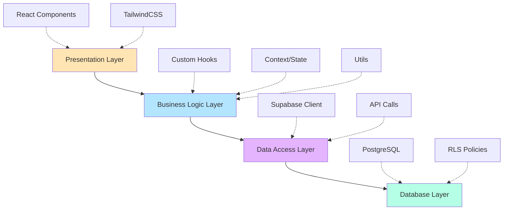
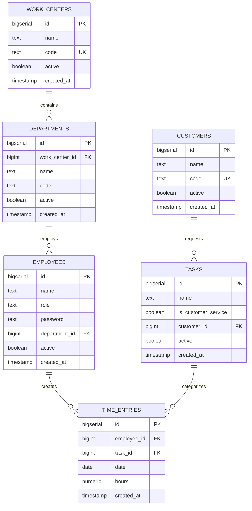
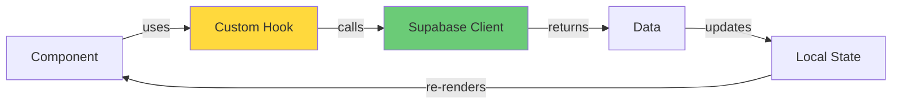
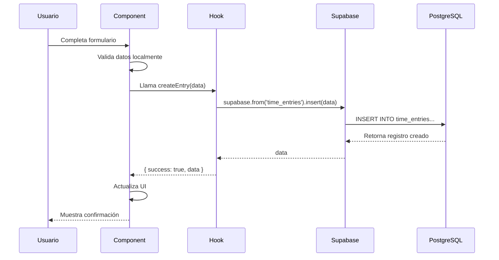
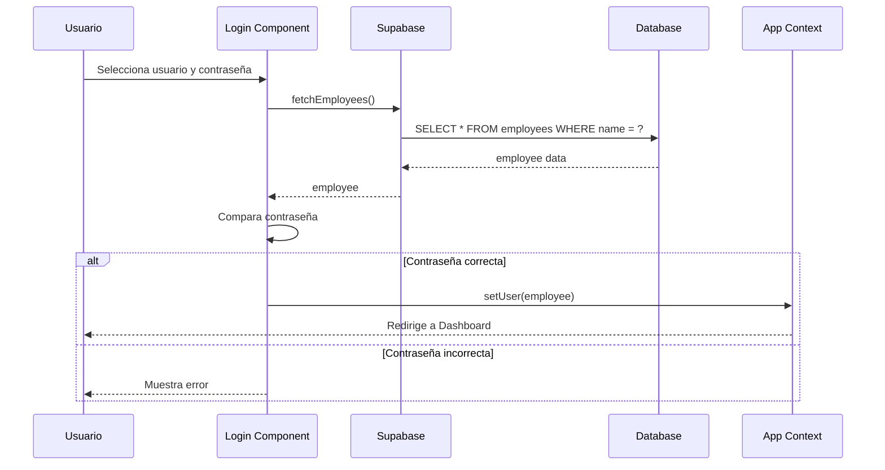

# 🔧 Manual Técnico - CTC Daily Hours

**Documentación Técnica del Sistema**

Versión 2.0 - Febrero 2026

---

## 📑 Tabla de Contenidos

1. [Arquitectura del Sistema](#arquitectura-del-sistema)
2. [Stack Tecnológico](#stack-tecnológico)
3. [Estructura del Proyecto](#estructura-del-proyecto)
4. [Base de Datos](#base-de-datos)
5. [Componentes Frontend](#componentes-frontend)
6. [Hooks y Estado](#hooks-y-estado)
7. [Flujo de Datos](#flujo-de-datos)
8. [Autenticación y Autorización](#autenticación-y-autorización)
9. [API y Servicios](#api-y-servicios)
10. [Despliegue](#despliegue)
11. [Mantenimiento](#mantenimiento)

---

## Arquitectura del Sistema

### Diagrama de Alto Nivel

```mermaid
graph TB
    subgraph "Frontend - React SPA"
        A[React App] --> B[Components]
        A --> C[Custom Hooks]
        A --> D[Utils]
        B --> E[UI Components]
        C --> F[Data Management]
    end
    
    subgraph "Backend - Supabase"
        G[PostgreSQL Database] --> H[Tables]
        G --> I[RLS Policies]
        G --> J[Indexes]
        K[Supabase API] --> G
    end
    
    A -->|REST API| K
    
    subgraph "Hosting"
        L[GitHub Pages]
        M[CDN]
    end
    
    A --> L
    L --> M
    
    style A fill:#61DAFB
    style G fill:#3ECF8E
    style L fill:#181717
```



### Arquitectura en Capas



---

## Stack Tecnológico

### Frontend

| Tecnología | Versión | Propósito |
|------------|---------|-----------|
| **React** | 18.2.0 | Framework UI principal |
| **Vite** | 5.0.8 | Build tool y dev server |
| **TailwindCSS** | 3.4.1 | Estilos y diseño |
| **PostCSS** | 8.4.32 | Procesamiento CSS |
| **@supabase/supabase-js** | 2.38.4 | Cliente de base de datos |
| **xlsx** | Latest | Exportación a Excel |
| **jspdf** | Latest | Exportación a PDF |
| **jspdf-autotable** | Latest | Tablas en PDF |

### Backend e Infraestructura

| Tecnología | Propósito |
|------------|-----------|
| **Supabase** | BaaS (Backend as a Service) |
| **PostgreSQL** | Base de datos relacional |
| **GitHub Pages** | Hosting estático |
| **GitHub Actions** | CI/CD (opcional) |

---

## Estructura del Proyecto

### Árbol de Directorios

```
CTCDailyHours/
├── public/                          # Archivos estáticos
│   ├── favicon.ico
│   └── manifest.json
│
├── src/                             # Código fuente
│   ├── components/                  # Componentes React
│   │   ├── AdminPanel.jsx          # Panel administrativo
│   │   ├── Calendar.jsx            # Calendario mensual
│   │   ├── DayView.jsx             # Vista de día
│   │   ├── DepartmentManagement.jsx # CRUD Departamentos
│   │   ├── EmployeeManagement.jsx  # CRUD Empleados
│   │   ├── EmployeeSelector.jsx    # Selector de empleados
│   │   ├── Layout.jsx              # Layout base
│   │   ├── Login.jsx               # Autenticación
│   │   ├── SummaryTable.jsx        # Tabla de reportes
│   │   ├── TaskManagement.jsx      # CRUD Tareas
│   │   ├── TimeEntryForm.jsx       # Formulario de registro
│   │   ├── TimeEntryRow.jsx        # Fila de entrada
│   │   ├── WeeklyCalendar.jsx      # Calendario semanal
│   │   └── WorkCenterManagement.jsx # CRUD Centros
│   │
│   ├── data/                        # Datos y constantes
│   │   └── mockData.js             # Datos de prueba
│   │
│   ├── hooks/                       # Custom Hooks
│   │   ├── useCustomers.js         # Hook de clientes
│   │   ├── useDepartmentManagement.js # CRUD Departamentos
│   │   ├── useDepartments.js       # Hook de departamentos
│   │   ├── useEmployeeManagement.js # CRUD Empleados
│   │   ├── useEmployees.js         # Hook de empleados
│   │   ├── useTasks.js             # CRUD Tareas
│   │   ├── useTimeEntries.js       # Hook de entradas
│   │   ├── useWorkCenterManagement.js # CRUD Centros
│   │   └── useWorkCenters.js       # Hook de centros
│   │
│   ├── lib/                         # Librerías y clientes
│   │   └── supabase.js             # Cliente Supabase
│   │
│   ├── utils/                       # Utilidades
│   │   └── exportHelpers.js        # Exportación de datos
│   │
│   ├── App.jsx                      # Componente raíz
│   ├── main.jsx                     # Entry point
│   └── index.css                    # Estilos globales
│
├── docs/                            # Documentación
│   ├── MANUAL_USUARIO.md
│   ├── MANUAL_TECNICO.md
│   └── ARQUITECTURA.md
│
├── database_migration.sql           # Migración de BD
├── database_seed.sql                # Datos iniciales
├── .env.example                     # Template de variables
├── .gitignore
├── index.html
├── package.json
├── postcss.config.js
├── README.md
├── tailwind.config.js
└── vite.config.js
```

---

## Base de Datos

### Diagrama Entidad-Relación



### Esquema SQL Completo

```sql
-- ====================================
-- WORK CENTERS (Centros de Trabajo)
-- ====================================
CREATE TABLE work_centers (
  id BIGSERIAL PRIMARY KEY,
  name TEXT NOT NULL,
  code TEXT NOT NULL UNIQUE,
  active BOOLEAN DEFAULT true,
  created_at TIMESTAMP WITH TIME ZONE DEFAULT NOW()
);

-- ====================================
-- DEPARTMENTS (Departamentos)
-- ====================================
CREATE TABLE departments (
  id BIGSERIAL PRIMARY KEY,
  work_center_id BIGINT NOT NULL REFERENCES work_centers(id) ON DELETE RESTRICT,
  name TEXT NOT NULL,
  code TEXT NOT NULL,
  active BOOLEAN DEFAULT true,
  created_at TIMESTAMP WITH TIME ZONE DEFAULT NOW(),
  UNIQUE(work_center_id, code)
);

-- ====================================
-- CUSTOMERS (Clientes)
-- ====================================
CREATE TABLE customers (
  id BIGSERIAL PRIMARY KEY,
  name TEXT NOT NULL,
  code TEXT NOT NULL UNIQUE,
  active BOOLEAN DEFAULT true,
  created_at TIMESTAMP WITH TIME ZONE DEFAULT NOW()
);

-- ====================================
-- TASKS (Tareas)
-- ====================================
CREATE TABLE tasks (
  id BIGSERIAL PRIMARY KEY,
  name TEXT NOT NULL,
  is_customer_service BOOLEAN DEFAULT false,
  customer_id BIGINT REFERENCES customers(id) ON DELETE SET NULL,
  active BOOLEAN DEFAULT true,
  created_at TIMESTAMP WITH TIME ZONE DEFAULT NOW()
);

-- ====================================
-- EMPLOYEES (Empleados)
-- ====================================
CREATE TABLE employees (
  id BIGSERIAL PRIMARY KEY,
  name TEXT NOT NULL,
  role TEXT NOT NULL CHECK (role IN ('employee', 'responsible', 'admin')),
  password TEXT NOT NULL,
  department_id BIGINT REFERENCES departments(id) ON DELETE RESTRICT,
  active BOOLEAN DEFAULT true,
  created_at TIMESTAMP WITH TIME ZONE DEFAULT NOW()
);

-- ====================================
-- TIME ENTRIES (Entradas de Tiempo)
-- ====================================
CREATE TABLE time_entries (
  id BIGSERIAL PRIMARY KEY,
  employee_id BIGINT NOT NULL REFERENCES employees(id) ON DELETE CASCADE,
  task_id BIGINT NOT NULL REFERENCES tasks(id) ON DELETE RESTRICT,
  date DATE NOT NULL,
  hours NUMERIC(4,2) NOT NULL CHECK (hours > 0 AND hours <= 24),
  created_at TIMESTAMP WITH TIME ZONE DEFAULT NOW()
);

-- ====================================
-- INDEXES (Índices para Optimización)
-- ====================================
CREATE INDEX idx_departments_work_center ON departments(work_center_id);
CREATE INDEX idx_employees_department ON employees(department_id);
CREATE INDEX idx_employees_role ON employees(role);
CREATE INDEX idx_employees_active ON employees(active);
CREATE INDEX idx_tasks_active ON tasks(active);
CREATE INDEX idx_tasks_customer ON tasks(customer_id);
CREATE INDEX idx_time_entries_employee ON time_entries(employee_id);
CREATE INDEX idx_time_entries_task ON time_entries(task_id);
CREATE INDEX idx_time_entries_date ON time_entries(date);
CREATE INDEX idx_time_entries_employee_date ON time_entries(employee_id, date);
```

### Row Level Security (RLS)

```sql
-- Habilitar RLS en todas las tablas
ALTER TABLE work_centers ENABLE ROW LEVEL SECURITY;
ALTER TABLE departments ENABLE ROW LEVEL SECURITY;
ALTER TABLE customers ENABLE ROW LEVEL SECURITY;
ALTER TABLE tasks ENABLE ROW LEVEL SECURITY;
ALTER TABLE employees ENABLE ROW LEVEL SECURITY;
ALTER TABLE time_entries ENABLE ROW LEVEL SECURITY;

-- Políticas permisivas (autenticación custom)
CREATE POLICY "Allow public read on active work_centers" ON work_centers
  FOR SELECT USING (active = true);

CREATE POLICY "Allow public read on active departments" ON departments
  FOR SELECT USING (active = true);

CREATE POLICY "Allow public read on active customers" ON customers
  FOR SELECT USING (active = true);

CREATE POLICY "Allow public read on active tasks" ON tasks
  FOR SELECT USING (active = true);

CREATE POLICY "Allow public operations on employees" ON employees
  FOR ALL USING (true);

CREATE POLICY "Allow public operations on time_entries" ON time_entries
  FOR ALL USING (true);
```

### Relaciones y Constraints

| Relación | Tipo | On Delete |
|----------|------|-----------|
| departments → work_centers | Many-to-One | RESTRICT |
| employees → departments | Many-to-One | RESTRICT |
| tasks → customers | Many-to-One | SET NULL |
| time_entries → employees | Many-to-One | CASCADE |
| time_entries → tasks | Many-to-One | RESTRICT |

---

## Componentes Frontend

### Componentes Principales

#### 1. App.jsx (Componente Raíz)

**Responsabilidades:**
- Estado de autenticación
- Routing básico
- Context providers

**Estado:**
```javascript
{
  user: null | {
    id: number,
    name: string,
    role: 'employee' | 'responsible' | 'admin'
  }
}
```

#### 2. Login.jsx

**Estado:**
```javascript
{
  selectedUser: string,
  password: string,
  error: string | null
}
```

**Flujo:**
1. Usuario selecciona nombre del dropdown
2. Introduce contraseña
3. Valida contra BD
4. Actualiza context de usuario

#### 3. Layout.jsx

**Props:**
```typescript
{
  user: User,
  onLogout: () => void,
  children: React.ReactNode
}
```

**Responsabilidades:**
- Barra de navegación
- Tabs de navegación
- Indicador de rol
- Botón de logout

#### 4. WeeklyCalendar.jsx

**Estado:**
```javascript
{
  currentWeek: Date,
  entries: TimeEntry[],
  selectedEmployee: number | null,
  showEntryForm: boolean
}
```

**Hooks utilizados:**
- `useTimeEntries()`
- `useTasks()`
- `useEmployees()` (responsables)

#### 5. AdminPanel.jsx

**Sub-componentes:**
- `EmployeeManagement`
- `TaskManagement`
- `WorkCenterManagement`
- `DepartmentManagement`

---

## Hooks y Estado

### Patrón de Custom Hooks



### Hook de Datos (useEmployees)

```javascript
import { useState, useEffect } from 'react'
import { fetchEmployees } from '../lib/supabase'

export function useEmployees() {
  const [employees, setEmployees] = useState([])
  const [loading, setLoading] = useState(true)
  const [error, setError] = useState(null)

  useEffect(() => {
    async function load() {
      try {
        const data = await fetchEmployees()
        setEmployees(data)
      } catch (err) {
        setError(err.message)
      } finally {
        setLoading(false)
      }
    }
    load()
  }, [])

  return { employees, loading, error }
}
```

### Hook de Gestión (useEmployeeManagement)

```javascript
export function useEmployeeManagement() {
  const [loading, setLoading] = useState(false)
  const [error, setError] = useState(null)

  const addEmployee = async (name, role, password, departmentId) => {
    try {
      setLoading(true)
      const { data, error } = await supabase
        .from('employees')
        .insert([{ name, role, password, department_id: departmentId }])
      
      if (error) throw error
      return { success: true, data }
    } catch (err) {
      return { success: false, error: err.message }
    } finally {
      setLoading(false)
    }
  }

  return {
    loading,
    error,
    addEmployee,
    // ... otros métodos
  }
}
```

### Hooks Disponibles

| Hook | Propósito | Operaciones |
|------|-----------|-------------|
| `useEmployees` | Fetch empleados | Read |
| `useEmployeeManagement` | CRUD empleados | Create, Read, Update, Toggle |
| `useTasks` | CRUD tareas | Full CRUD |
| `useTimeEntries` | Gestión entradas | Create, Read, Update, Delete |
| `useWorkCenters` | Fetch centros | Read |
| `useWorkCenterManagement` | CRUD centros | Full CRUD |
| `useDepartments` | Fetch departamentos | Read |
| `useDepartmentManagement` | CRUD departamentos | Full CRUD |
| `useCustomers` | Fetch clientes | Read |

---

## Flujo de Datos

### Flujo de Registro de Horas



### Flujo de Autenticación



---

## Autenticación y Autorización

### Control de Acceso en Componentes

```javascript
// Ejemplo: Protección de rutas por rol
function AdminPanel({ user }) {
  if (user.role !== 'admin') {
    return <div>Acceso denegado</div>
  }
  
  return (
    <div>
      {/* Panel de administración */}
    </div>
  )
}

// Ejemplo: Filtrado de datos por rol
async function fetchTimeEntries(user) {
  let query = supabase
    .from('time_entries')
    .select('*')
  
  // Empleados solo ven sus propias entradas
  if (user.role === 'employee') {
    query = query.eq('employee_id', user.id)
  }
  
  // Responsables y admins ven todo
  const { data } = await query
  return data
}
```

---

## API y Servicios

### Cliente Supabase

**Inicialización:**

```javascript
// src/lib/supabase.js
import { createClient } from '@supabase/supabase-js'

const supabaseUrl = import.meta.env.VITE_SUPABASE_URL
const supabaseKey = import.meta.env.VITE_SUPABASE_ANON_KEY

export const supabase = createClient(supabaseUrl, supabaseKey)
```

### Funciones de API

#### Fetch con Joins

```javascript
export async function fetchTimeEntries() {
  const { data, error } = await supabase
    .from('time_entries')
    .select(`
      *,
      employee:employees(
        id,
        name,
        role,
        department:departments(
          id,
          name,
          code,
          work_center:work_centers(id, name, code)
        )
      ),
      task:tasks(
        id,
        name,
        is_customer_service,
        customer:customers(id, name, code)
      )
    `)
    .order('created_at', { ascending: false })
  
  if (error) throw error
  return data
}
```

#### Create con Validación

```javascript
export async function createEmployee(employee) {
  // Validación
  if (!employee.name || !employee.role || !employee.password) {
    throw new Error('Campos requeridos faltantes')
  }
  
  // Insert
  const { data, error } = await supabase
    .from('employees')
    .insert([{
      name: employee.name.trim(),
      role: employee.role,
      password: employee.password,
      department_id: employee.department_id,
      active: true
    }])
    .select()
  
  if (error) throw error
  return data[0]
}
```

---

## Despliegue

### Configuración de Build

**vite.config.js:**

```javascript
import { defineConfig } from 'vite'
import react from '@vitejs/plugin-react'

export default defineConfig({
  plugins: [react()],
  base: '/CTCDailyHours/',  // Debe coincidir con nombre del repo
  build: {
    outDir: 'dist',
    sourcemap: false,
    minify: 'terser',
    rollupOptions: {
      output: {
        manualChunks: {
          'react-vendor': ['react', 'react-dom'],
          'export-libs': ['xlsx', 'jspdf', 'jspdf-autotable']
        }
      }
    }
  }
})
```

### Variables de Entorno

**Desarrollo (`.env`):**
```env
VITE_SUPABASE_URL=https://your-project.supabase.co
VITE_SUPABASE_ANON_KEY=your-anon-key
```

**Producción (`.env.production`):**
```env
VITE_SUPABASE_URL=https://your-project.supabase.co
VITE_SUPABASE_ANON_KEY=your-anon-key
```

### Scripts de Deployment

```json
{
  "scripts": {
    "dev": "vite",
    "build": "vite build",
    "preview": "vite preview",
    "deploy": "npm run build && gh-pages -d dist"
  }
}
```

### Checklist Pre-Deploy

- [ ] Todas las pruebas pasan localmente
- [ ] Variables de entorno configuradas
- [ ] Build funciona sin errores
- [ ] Preview verificado localmente
- [ ] Commit y push de cambios
- [ ] Ejecutar `npm run deploy`
- [ ] Verificar despliegue en GitHub Pages
- [ ] Smoke test en producción

---

## Mantenimiento

### Monitoreo

**Métricas a Monitorear:**

1. **Performance:**
   - Tiempo de carga inicial
   - Tiempo de respuesta de queries
   - Tamaño de bundle

2. **Errores:**
   - Errores de JavaScript en browser
   - Errores de queries de Supabase
   - Fallos de autenticación

3. **Uso:**
   - Usuarios activos
   - Entradas creadas por día
   - Reportes generados

### Respaldos de Base de Datos

```sql
-- Script de respaldo (ejecutar en Supabase SQL Editor)
COPY (
  SELECT * FROM time_entries 
  WHERE date >= '2026-01-01'
) TO '/tmp/time_entries_backup_2026.csv' WITH CSV HEADER;
```

### Actualización de Dependencias

```bash
# Verificar dependencias desactualizadas
npm outdated

# Actualizar dependencias menores
npm update

# Actualizar dependencias mayores (con precaución)
npm install package@latest
```

### Optimización de Performance

**1. Code Splitting:**
```javascript
// Lazy loading de componentes pesados
const AdminPanel = lazy(() => import('./components/AdminPanel'))

<Suspense fallback={<Loader />}>
  <AdminPanel />
</Suspense>
```

**2. Memoización:**
```javascript
import { useMemo, useCallback } from 'react'

// Memoizar cálculos costosos
const totalHours = useMemo(() => {
  return entries.reduce((sum, entry) => sum + entry.hours, 0)
}, [entries])

// Memoizar callbacks
const handleSubmit = useCallback(() => {
  // handler logic
}, [dependencies])
```

**3. Índices de Base de Datos:**
```sql
-- Agregar índices para queries frecuentes
CREATE INDEX IF NOT EXISTS idx_time_entries_date_employee 
ON time_entries(date, employee_id);

CREATE INDEX IF NOT EXISTS idx_employees_department_active 
ON employees(department_id, active) WHERE active = true;
```

### Debugging

**Herramientas:**

1. **React DevTools**: Inspeccionar componentes y estado
2. **Network Tab**: Monitorear llamadas a Supabase
3. **Console**: Logs de errores y warnings

**Técnicas:**

```javascript
// Logging condicional
if (import.meta.env.DEV) {
  console.log('Debug:', data)
}

// Error boundaries
class ErrorBoundary extends React.Component {
  componentDidCatch(error, errorInfo) {
    console.error('Error caught:', error, errorInfo)
  }
  
  render() {
    if (this.state.hasError) {
      return <h1>Something went wrong.</h1>
    }
    return this.props.children
  }
}
```

### Troubleshooting Común

| Problema | Causa Probable | Solución |
|----------|----------------|----------|
| Build falla | Dependencias rotas | `rm -rf node_modules && npm install` |
| Queries lentas | Falta índice en BD | Agregar índice apropiado |
| 404 en producción | Base incorrecta en vite.config | Verificar `base: '/repo-name/'` |
| RLS bloquea queries | Política incorrecta | Revisar políticas en Supabase |
| CORS errors | Configuración Supabase | Verificar allowed origins |

---

## Seguridad

### Mejores Prácticas

**1. Nunca exponer claves privadas:**
```javascript
// ❌ MAL
const supabaseKey = 'sk_live_xxx...'  // Service key expuesta

// ✅ BIEN
const supabaseKey = import.meta.env.VITE_SUPABASE_ANON_KEY  // Solo anon key en frontend
```

**2. Validación en ambos lados:**
```javascript
// Frontend
if (!employee.name || employee.name.length < 2) {
  throw new Error('Nombre inválido')
}

// Backend (RLS + Triggers)
CREATE TRIGGER validate_employee_name
BEFORE INSERT OR UPDATE ON employees
FOR EACH ROW EXECUTE FUNCTION check_employee_name();
```

**3. Sanitización de inputs:**
```javascript
// Supabase maneja SQL injection automáticamente
// Pero siempre valida datos de usuario
const sanitizedName = name.trim().slice(0, 100)
```

---

## Referencias Útiles

- [React Documentation](https://react.dev)
- [Vite Documentation](https://vitejs.dev)
- [Supabase Documentation](https://supabase.com/docs)
- [TailwindCSS Documentation](https://tailwindcss.com/docs)
- [PostgreSQL Documentation](https://www.postgresql.org/docs/)

---

**Versión del documento**: 2.0 - Febrero 2026  
**Última actualización**: 24/02/2026  
**Autor**: Equipo de Desarrollo CTC

---

*Documentación Técnica - CTC Daily Hours*
