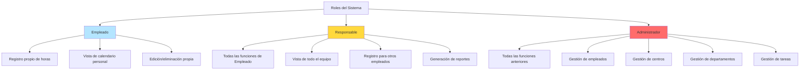

# 📖 Manual de Usuario - CTC Daily Hours

**Guía Funcional para Usuarios**

Versión 2.0 - Febrero 2026

---

## 📑 Tabla de Contenidos

1. [Introducción](#introducción)
2. [Acceso al Sistema](#acceso-al-sistema)
3. [Roles y Permisos](#roles-y-permisos)
4. [Guía para Empleados](#guía-para-empleados)
5. [Guía para Responsables](#guía-para-responsables)
6. [Guía para Administradores](#guía-para-administradores)
7. [Funciones Comunes](#funciones-comunes)
8. [Reportes y Exportaciones](#reportes-y-exportaciones)
9. [Preguntas Frecuentes](#preguntas-frecuentes)
10. [Solución de Problemas](#solución-de-problemas)

---

## Introducción

**CTC Daily Hours** es un sistema de gestión de horas de trabajo que permite a los empleados registrar sus actividades diarias, a los responsables supervisar equipos y a los administradores gestionar toda la organización.

### Características Principales

- ✅ **Registro de Horas**: Interfaz intuitiva para registrar horas por tarea
- 📅 **Vista Semanal**: Calendario visual con totales diarios
- 📊 **Reportes**: Generación de informes personalizables
- 📥 **Exportación**: Descarga de datos en Excel, PDF o CSV
- 👥 **Multi-rol**: Sistema de permisos adaptado a cada rol
- 🏢 **Multi-centro**: Soporte para múltiples centros y departamentos

---

## Acceso al Sistema

### Inicio de Sesión

1. **Accede a la aplicación** a través del navegador web
2. **Pantalla de Login**: Verás un formulario con dos campos
   - **Selector de Usuario**: Desplegable con lista de empleados
   - **Contraseña**: Campo de texto oculto


3. **Selecciona tu nombre** del desplegable
4. **Introduce tu contraseña**
5. **Haz clic en "Iniciar Sesión"**

### Credenciales Iniciales

Al inicio, utiliza estas credenciales de prueba:

| Usuario | Contraseña | Rol |
|---------|------------|-----|
| Admin Sistema | `admin123` | Administrador |
| Pedro Sanchez | `pedro123` | Responsable |
| Juan Garcia | `juan123` | Empleado |

⚠️ **Importante**: Cambia tu contraseña tras el primer inicio de sesión.

### Cierre de Sesión

Para salir del sistema:
1. Haz clic en tu nombre en la esquina superior derecha
2. Selecciona **"Cerrar Sesión"**

---

## Roles y Permisos

El sistema tiene **3 roles** con diferentes niveles de acceso:



### Comparación de Permisos

| Función | Empleado | Responsable | Administrador |
|---------|----------|-------------|---------------|
| Registrar sus horas | ✅ | ✅ | ✅ |
| Ver su calendario | ✅ | ✅ | ✅ |
| Editar sus entradas | ✅ | ✅ | ✅ |
| Ver horas de otros | ❌ | ✅ | ✅ |
| Registrar para otros | ❌ | ✅ | ✅ |
| Eliminar entradas ajenas | ❌ | ✅ | ✅ |
| Generar reportes | ❌ | ✅ | ✅ |
| Exportar datos | ❌ | ✅ | ✅ |
| Gestionar empleados | ❌ | ❌ | ✅ |
| Gestionar tareas | ❌ | ❌ | ✅ |
| Gestionar centros | ❌ | ❌ | ✅ |
| Gestionar departamentos | ❌ | ❌ | ✅ |

---

## Guía para Empleados

### 1. Registrar Horas de Trabajo

#### Método 1: Desde el Calendario Semanal

**Pasos:**

1. Navega a la pestaña **"Calendario"**
2. Verás tu semana actual con 7 columnas (Lun-Dom)
3. Haz clic en el botón **"+ Agregar Entrada"** en cualquier día
4. Completa el formulario:
   - **Empleado**: Pre-seleccionado (tú)
   - **Tarea**: Selecciona de la lista desplegable
   - **Cliente** (opcional): Solo si la tarea requiere asistencia a cliente
   - **Fecha**: Pre-seleccionada (día elegido)
   - **Horas**: Introduce número decimal (ej: 2.5 para 2h 30min)
5. Haz clic en **"Guardar"**


#### Método 2: Desde la Vista de Día

**Pasos:**

1. En el calendario, haz clic en cualquier día
2. Se abre una vista detallada con todas tus entradas de ese día
3. Haz clic en **"Agregar Nueva Entrada"**
4. Sigue los pasos 4-5 del método anterior

### 2. Ver tu Calendario Semanal

**Información mostrada por día:**
- ✅ Lista de tareas realizadas
- 🕒 Horas dedicadas a cada tarea
- 📊 Total de horas del día
- 🏢 Tu departamento y centro de trabajo

**Navegación:**
- **Botones ◀ ▶**: Cambiar semana (anterior/siguiente)
- **Hoy**: Volver a semana actual
- **Filtros**: Buscar entradas específicas

### 3. Editar o Eliminar Entradas

#### Editar:
1. Localiza la entrada en el calendario
2. Haz clic en el icono de **lápiz (✏️)**
3. Modifica los campos necesarios
4. Guarda los cambios

#### Eliminar:
1. Localiza la entrada en el calendario
2. Haz clic en el icono de **papelera (🗑️)**
3. Confirma la eliminación

⚠️ **Restricción**: Solo puedes editar/eliminar **tus propias entradas**

### 4. Ejemplos de Uso

#### Ejemplo 1: Día con Múltiples Tareas

**Lunes 24/02/2026:**
- 09:00-11:30 → Clasificación Férricos: **2.5 horas**
- 11:30-14:00 → Carga de Camión: **2.5 horas**
- 14:00-15:00 → Pausa (no se registra)
- 15:00-17:00 → Limpieza: **2 horas**

**Total del día: 7 horas**

#### Ejemplo 2: Registro con Cliente

**Tarea**: Asistencia Cliente  
**Cliente**: Cliente Alpha  
**Horas**: 4.0  
**Resultado**: Se crea entrada vinculada al cliente

---

## Guía para Responsables

Los responsables tienen **todos los permisos de empleados** más funciones adicionales de supervisión.

### 1. Ver Horas de tu Equipo

**Selector de Empleados:**
1. Ve a la pestaña **"Calendario"**
2. En la parte superior, verás un **selector de empleados**
3. Selecciona **"Todos"** para ver todo el equipo
4. O selecciona un empleado específico


**Vista agregada:**
- Muestra entradas de todos los empleados seleccionados
- Cada entrada indica el nombre del empleado
- Los colores diferencian entre usuarios

### 2. Registrar Horas para Otros

**Pasos:**
1. Haz clic en **"+ Agregar Entrada"**
2. En el formulario, **cambia el empleado** en el selector
3. Completa los demás campos
4. Guarda

**Casos de uso:**
- Empleado olvidó registrar sus horas
- Correcciones de registros pasados
- Registro en nombre de empleado ausente

### 3. Gestionar Entradas de Otros

Como responsable, puedes:
- ✏️ **Editar** cualquier entrada de tu equipo
- 🗑️ **Eliminar** entradas incorrectas
- 📊 **Validar** registros antes de reportes

### 4. Generar Reportes

**Acceso:**
1. Navega a la pestaña **"Reportes"**
2. Verás una tabla resumen con filtros

**Filtros Disponibles:**
- 📅 **Rango de Fechas**: Desde/Hasta
- 👤 **Empleados**: Multi-selección
- 📋 **Tareas**: Multi-selección
- 🏢 **Centros de Trabajo**: Multi-selección
- 🏭 **Departamentos**: Multi-selección

**Vistas:**
- **Por Empleado**: Horas totales por persona
- **Por Tarea**: Horas totales por actividad
- **Por Período**: Distribución temporal

**Exportación:**
- **Excel (.xlsx)**: Para análisis detallado
- **PDF**: Para impresión y archivo
- **CSV**: Para importar en otros sistemas


### 5. Ejemplos de Reportes

#### Ejemplo 1: Reporte Semanal del Equipo

**Filtros:**
- Fechas: 17/02/2026 - 23/02/2026
- Empleados: "Todos" (tu departamento)
- Vista: Por Empleado

**Resultado:**
| Empleado | Horas Totales | Días Trabajados |
|----------|---------------|-----------------|
| Juan García | 40.0 | 5 |
| María Rodríguez | 38.5 | 5 |
| José Martínez | 35.0 | 5 |

#### Ejemplo 2: Reporte de Tarea Específica

**Filtros:**
- Fechas: Febrero 2026
- Tarea: "Asistencia Cliente"
- Cliente: "Cliente Alpha"
- Vista: Por Empleado

**Uso**: Facturación por cliente

---

## Guía para Administradores

Los administradores tienen **acceso completo** al sistema.

### 1. Panel de Administración

**Acceso:**
- Pestaña **"Admin"** en la barra de navegación
- 4 sub-pestañas disponibles:
  - 👥 **Empleados**
  - 📋 **Tareas**
  - 🏢 **Centros de Trabajo**
  - 🏭 **Departamentos**

### 2. Gestión de Empleados

#### Crear Nuevo Empleado

**Pasos:**
1. Ve a **Admin → Empleados**
2. Haz clic en **"Crear Nuevo Empleado"**
3. Completa el formulario:
   - **Nombre Completo**: Texto obligatorio
   - **Rol**: Empleado / Responsable / Admin
   - **Contraseña Inicial**: Mínimo 6 caracteres
   - **Departamento**: Selección desplegable
4. Haz clic en **"Guardar"**


#### Editar Empleado

**Pasos:**
1. Localiza el empleado en la tabla
2. Haz clic en el icono de **lápiz (✏️)**
3. Modifica los campos necesarios
4. Guarda cambios

**Campos editables:**
- Nombre
- Rol
- Contraseña (dejar vacío para no cambiar)
- Departamento

#### Desactivar/Activar Empleado

**Pasos:**
1. Localiza el empleado en la tabla
2. Haz clic en el botón de **estado**:
   - **Desactivar**: Empleado activo → Inactivo
   - **Activar**: Empleado inactivo → Activo

⚠️ **Nota**: Los empleados inactivos:
- No pueden iniciar sesión
- No aparecen en selectores
- Sus datos históricos se conservan

#### Filtros de Empleados

- **Centro de Trabajo**: Filtra por ubicación
- **Departamento**: Filtra por área
- **Rol**: Filtra por tipo de usuario
- **Estado**: Activos / Inactivos / Todos
- **Búsqueda**: Por nombre

### 3. Gestión de Centros de Trabajo

#### Crear Centro

**Campos:**
- **Nombre**: "Madrid", "Sevilla", etc.
- **Código**: "MAD", "SEV" (único, mayúsculas)

**Validaciones:**
- Código único en todo el sistema
- Formato: solo letras, 2-5 caracteres

#### Editar Centro

**Restricciones:**
- No se puede cambiar el código si hay departamentos asociados
- El nombre puede cambiarse libremente

#### Desactivar Centro

**Efecto:**
- Centro no aparece en selectores
- Departamentos asociados se desactivan automáticamente
- Datos históricos se conservan

### 4. Gestión de Departamentos

#### Crear Departamento

**Formulario:**
- **Centro de Trabajo**: Selección obligatoria
- **Nombre**: "Producción", "Logística", etc.
- **Código**: "PROD", "LOG" (único por centro)

**Validación clave:**
- El código debe ser único **dentro del centro**
- Dos centros pueden tener departamentos con el mismo código

**Ejemplo válido:**
- Madrid → Producción (PROD)
- Sevilla → Producción (PROD) ✅

**Ejemplo inválido:**
- Madrid → Producción (PROD)
- Madrid → Producción General (PROD) ❌ (código duplicado)

#### Editar Departamento

**Campos modificables:**
- Nombre del departamento
- Código (verificando unicidad)
- Centro de trabajo (con validación de empleados)

#### Desactivar Departamento

**Efecto:**
- No aparece en selectores de nuevos empleados
- Empleados existentes conservan su asignación
- Se puede reactivar en cualquier momento

### 5. Gestión de Tareas

#### Crear Tarea

**Tipos de tareas:**

**A) Tarea General:**
- Nombre: "Clasificación Férricos", "Carga de Camión"
- **No** requiere cliente
- Disponible para todos

**B) Tarea de Asistencia a Cliente:**
- Nombre: "Asistencia Cliente"
- **Requiere** selección de cliente
- Se asocia a un cliente específico

**Formulario:**
- **Nombre**: Descripción de la tarea
- **¿Es asistencia a cliente?**: Checkbox
- **Cliente** (si aplica): Selección desplegable

#### Editar Tarea

**Restricciones:**
- No se puede cambiar tipo (general ↔ cliente) si hay registros
- Se puede cambiar el nombre libremente
- Se puede cambiar el cliente asociado

#### Desactivar Tarea

**Efecto:**
- No aparece en formularios de registro
- Entradas históricas se conservan
- Se puede reactivar

### 6. Ejemplos de Configuración Completa

#### Ejemplo: Nuevo Centro con Departamentos

**Paso 1 - Crear Centro:**
- Nombre: "Valencia"
- Código: "VAL"

**Paso 2 - Crear Departamentos:**
1. Centro: Valencia → Producción (PROD)
2. Centro: Valencia → Logística (LOG)
3. Centro: Valencia → Mantenimiento (MANT)

**Paso 3 - Crear Empleados:**
1. Responsable: "Luis Martínez", Depto: Producción (VAL)
2. Empleado: "Ana Torres", Depto: Producción (VAL)
3. Empleado: "Carlos Ruiz", Depto: Logística (VAL)

**Resultado**: Centro operativo con estructura completa

---

## Funciones Comunes

### Calendario Semanal

#### Elementos de la Vista

```
┌─────────────────────────────────────────────────┐
│  ◀ Semana del 17-23 Febrero 2026 ▶   [Hoy]    │
├─────────────────────────────────────────────────┤
│  LUN    MAR    MIE    JUE    VIE    SAB    DOM │
│   17     18     19     20     21     22     23  │
├─────┬───────┬───────┬───────┬───────┬───────┬───┤
│ ✓ 8h│ ✓ 7.5h│ ✓ 8h │ ✓ 8h │ ✓ 6h │       │    │
│     │       │       │       │       │       │    │
│ • Clas..│ • Carga│• Mant.│• Clas..│• Limpie│     │    │
│   3.0h│   4.0h│  5.0h│  4.5h│  2.0h│     │    │
│ • Carga│ • Limpie│• Carga│• Limpie│• Carga│     │    │
│   5.0h│   3.5h│  3.0h│  3.5h│  4.0h│     │    │
└─────┴───────┴───────┴───────┴───────┴───────┴───┘
```

#### Indicadores de Color

- 🟢 **Verde**: Día con horas registradas
- ⚪ **Blanco**: Día sin registros
- 🔵 **Azul**: Día actual
- 🟡 **Amarillo**: Día con menos de 6 horas

### Vista de Día

**Acceso**: Clic en cualquier día del calendario

**Muestra:**
- Fecha completa
- Lista detallada de todas las entradas
- Total de horas del día
- Botones de acción (Agregar, Editar, Eliminar)

**Navegación:**
- Botones ◀ ▶ para día anterior/siguiente
- Botón "Volver" al calendario semanal

---

## Reportes y Exportaciones

### Tipos de Reportes

#### 1. Reporte por Empleado

**Información:**
- Nombre de cada empleado
- Horas totales en el período
- Distribución por tarea
- Promedio diario

**Cuándo usar:**
- Nómina mensual
- Evaluación de carga de trabajo
- Análisis de productividad

#### 2. Reporte por Tarea

**Información:**
- Cada tarea realizada
- Horas totales dedicadas
- Empleados que la realizaron
- Distribución temporal

**Cuándo usar:**
- Análisis de procesos
- Identificar cuellos de botella
- Optimización de recursos

#### 3. Reporte por Período

**Información:**
- Resumen día por día
- Totales acumulados
- Tendencias y patrones
- Comparativas

**Cuándo usar:**
- Reportes semanales/mensuales
- Planificación de recursos
- Análisis históricos

### Filtros Disponibles

#### Fechas

**Opciones:**
- **Rango personalizado**: Desde - Hasta
- **Presets rápidos**:
  - Hoy
  - Esta semana
  - Este mes
  - Mes pasado
  - Últimos 7/30/90 días

#### Selección de Datos

**Multi-selección disponible en:**
- ✅ Empleados: Uno, varios o todos
- ✅ Tareas: Una, varias o todas
- ✅ Centros: Uno, varios o todos
- ✅ Departamentos: Uno, varios o todos
- ✅ Clientes: Uno, varios o todos

### Formatos de Exportación

#### Excel (.xlsx)

**Ventajas:**
- Permite análisis avanzado con fórmulas
- Gráficos y tablas dinámicas
- Compatible con Office y Google Sheets

**Estructura:**
- Hoja 1: Datos detallados
- Hoja 2: Resumen
- Formato con estilos y colores

**Cuándo usar:**
- Análisis de datos
- Compartir con finanzas
- Reportes internos

#### PDF

**Ventajas:**
- Formato profesional para impresión
- No editable (integridad)
- Universal (cualquier dispositivo)

**Características:**
- Logo de la empresa
- Fecha de generación
- Paginación automática
- Totales por página

**Cuándo usar:**
- Reportes oficiales
- Archivo de documentos
- Presentaciones a clientes

#### CSV

**Ventajas:**
- Ligero y rápido
- Fácil importación a otros sistemas
- Compatible con cualquier herramienta

**Formato:**
```
Empleado,Tarea,Fecha,Horas,Departamento,Centro
Juan García,Clasificación Férricos,2026-02-17,3.0,Producción,Madrid
Juan García,Carga de Camión,2026-02-17,5.0,Producción,Madrid
```

**Cuándo usar:**
- Integración con ERP
- Procesamiento masivo
- Análisis con herramientas propias

### Proceso de Exportación

**Pasos:**
1. Aplica los **filtros** deseados
2. Verifica los datos en la **vista previa**
3. Selecciona el **formato** (Excel/PDF/CSV)
4. Haz clic en **"Exportar"**
5. El archivo se **descarga** automáticamente

**Nombres de archivo:**
- Formato: `reporte-{tipo}-{fecha}.{ext}`
- Ejemplo: `reporte-empleados-2026-02-24.xlsx`

---

## Preguntas Frecuentes

### Generales

**P: ¿Puedo usar la aplicación desde mi móvil?**  
R: Sí, la interfaz es responsive y funciona en smartphones y tablets.

**P: ¿Se guardan automáticamente los cambios?**  
R: No, debes hacer clic en "Guardar" tras cada modificación.

**P: ¿Cuántas horas máximo puedo registrar por día?**  
R: El límite técnico es 24 horas, pero depende de la política de tu empresa.

**P: ¿Puedo registrar horas de días pasados?**  
R: Sí, puedes navegar a cualquier fecha y registrar horas.

**P: ¿Se pueden registrar decimales de hora?**  
R: Sí, puedes usar hasta 2 decimales (ej: 2.75 para 2h 45min).

### Sobre el Registro

**P: ¿Qué hago si me equivoqué en un registro?**  
R: Haz clic en el icono de lápiz (✏️) para editar o en la papelera (🗑️) para eliminar.

**P: ¿Puedo registrar la misma tarea varias veces en un día?**  
R: Sí, cada registro es independiente.

**P: ¿Debo registrar las pausas de comida?**  
R: No, solo registra tiempo trabajado efectivo.

**P: ¿Qué es "Asistencia a Cliente"?**  
R: Es una tarea especial que se asocia a un cliente específico para facturación.

### Sobre las Modificaciones

**P: ¿Hasta cuándo puedo editar un registro?**  
R: Depende de la política de tu empresa. Consulta con tu responsable.

**P: ¿Se notifica a alguien cuando edito mis horas?**  
R: No hay notificaciones automáticas, pero los responsables pueden ver el historial.

**P: ¿Puedo recuperar una entrada eliminada?**  
R: No, las eliminaciones son permanentes. Contacta a tu administrador.

### Sobre los Reportes

**P: ¿Por qué no aparecen todos mis empleados en el reporte?**  
R: Verifica los filtros activos (estado activo/inactivo, centro, departamento).

**P: ¿Puedo exportar un reporte sin aplicar filtros?**  
R: Sí, esto exportará TODOS los datos del sistema.

**P: ¿El PDF incluye gráficos?**  
R: No actualmente, solo tablas de datos.

**P: ¿Cuál es el límite de registros en un reporte?**  
R: No hay límite técnico, pero archivos muy grandes pueden tardar en generarse.

### Sobre la Administración

**P: ¿Puedo eliminar un empleado?**  
R: No se eliminan, se desactivan para preservar el historial.

**P: ¿Qué pasa con las horas de un empleado desactivado?**  
R: Se conservan en la base de datos y aparecen en reportes históricos.

**P: ¿Puedo cambiar el departamento de un empleado?**  
R: Sí, el cambio es inmediato y afecta solo futuros registros.

**P: ¿Cómo agrego un nuevo cliente?**  
R: Actualmente los clientes se gestionan desde la base de datos. Consulta con IT.

---

## Solución de Problemas

### Problemas de Acceso

#### No puedo iniciar sesión

**Síntoma**: Error "Credenciales incorrectas"

**Soluciones:**
1. Verifica que escribiste correctamente tu nombre (sensible a mayúsculas)
2. Confirma que tu contraseña es correcta
3. Si olvidaste tu contraseña, contacta al administrador
4. Verifica que tu cuenta esté activa

#### No aparezco en la lista de usuarios

**Posibles causas:**
- Tu cuenta está desactivada
- Aún no has sido dado de alta en el sistema

**Solución:** Contacta con Recursos Humanos o el administrador del sistema.

### Problemas con Registros

#### No puedo guardar una entrada

**Verifica:**
- ✓ Todos los campos obligatorios están completos
- ✓ El número de horas es válido (0.01 a 24.00)
- ✓ La fecha es válida
- ✓ Si es "Asistencia Cliente", seleccionaste un cliente

**Error común:**
```
❌ "El campo horas es requerido"
```
**Solución**: Asegúrate de introducir un valor numérico, no dejar vacío.

#### No veo mi registro recién creado

**Causas:**
1. No hiciste clic en "Guardar"
2. Estás en la semana equivocada
3. Hay un error de conexión

**Solución:**
1. Navega a la semana/día correcto
2. Refresca la página (F5)
3. Si persiste, contacta soporte técnico

#### No puedo editar una entrada

**Posible causa:** Solo responsables y administradores pueden editar entradas ajenas.

**Solución:**
- Verifica que sea tu propia entrada
- Si necesitas editar otra, contacta a tu responsable

### Problemas con Reportes

#### El reporte está vacío

**Verifica:**
1. Los filtros de fecha incluyen el período con datos
2. No hay filters restrictivos activos (empleado específico, tarea específica)
3. Los empleados/tareas seleccionados tienen registros

**Solución:** Haz clic en "Limpiar Filtros" y vuelve a intentar.

#### La exportación falla

**Síntomas:**
- El archivo no se descarga
- Error al generar PDF/Excel

**Soluciones:**
1. Verifica que tu navegador permite descargas
2. Libera espacio en disco
3. Intenta con menos registros (aplica filtros)
4. Prueba con otro formato

**Mensajes de error:**
```
❌ "Error al generar archivo"
```
**Causa:** Demasiados registros o problema de memoria.
**Solución:** Divide el reporte en períodos más cortos.

### Problemas de Administración

#### No puedo desactivar un centro

**Causa:** El centro tiene departamentos activos asociados.

**Solución:**
1. Primero desactiva todos los departamentos del centro
2. Luego desactiva el centro

#### Error al crear empleado

**Errores comunes:**

```
❌ "El código ya existe"
```
- Causa: Ya hay un centro/departamento con ese código
- Solución: Usa un código único

```
❌ "Debe seleccionar un departamento"
```
- Causa: Campo obligatorio vacío
- Solución: Selecciona un departamento de la lista

```
❌ "La contraseña debe tener al menos 6 caracteres"
```
- Causa: Contraseña demasiado corta
- Solución: Usa mínimo 6 caracteres

### Contacto con Soporte

**Si ninguna solución funciona:**

📧 **Email**: soporte@ctc-company.com  
📞 **Teléfono**: +34 900 123 456  
⏰ **Horario**: Lunes a Viernes, 9:00-18:00

**Información a proporcionar:**
1. Tu nombre de usuario
2. Descripción del problema
3. Pasos que seguiste
4. Capturas de pantalla (si es posible)
5. Navegador utilizado

---

## Consejos y Mejores Prácticas

### Para Empleados

✅ **Registra tus horas diariamente**: No dejes acumular trabajo  
✅ **Sé específico**: Usa la tarea correcta para cada actividad  
✅ **Revisa tu semana**: Verifica totales antes de cerrar la semana  
✅ **Avisa discrepancias**: Si hay errores, reporta de inmediato  

### Para Responsables

✅ **Revisa semanalmente**: Supervisa entradas de tu equipo  
✅ **Exporta regularmente**: Genera reportes al final de cada período  
✅ **Comunica**: Informa a tu equipo sobre inconsistencias  
✅ **Valida antes de facturar**: Revisa horas de "Asistencia Cliente"  

### Para Administradores

✅ **Backups regulares**: Exporta datos mensualmente  
✅ **Revisa cuentas inactivas**: Limpia usuarios que ya no trabajan  
✅ **Actualiza estructura**: Mantén centros y departamentos al día  
✅ **Documenta cambios**: Registra modificaciones importantes  

---

## Glosario

**Centro de Trabajo**: Ubicación física de la empresa (ej: Madrid, Sevilla)  
**Departamento**: Área funcional dentro de un centro (ej: Producción, Logística)  
**Entrada de Tiempo**: Registro de horas trabajadas en una tarea específica  
**Rol**: Nivel de permisos de un usuario (Empleado, Responsable, Administrador)  
**Tarea**: Actividad laboral registrable (ej: Clasificación, Mantenimiento)  
**Asistencia Cliente**: Tarea especial asociada a un cliente para facturación  
**Activo/Inactivo**: Estado de un registro (visible/oculto en el sistema)  

---

## Notas Finales

**Versión del documento**: 2.0 - Febrero 2026  
**Última actualización**: 24/02/2026  
**Soporte**: soporte@ctc-company.com

---

*Manual de Usuario - CTC Daily Hours*
